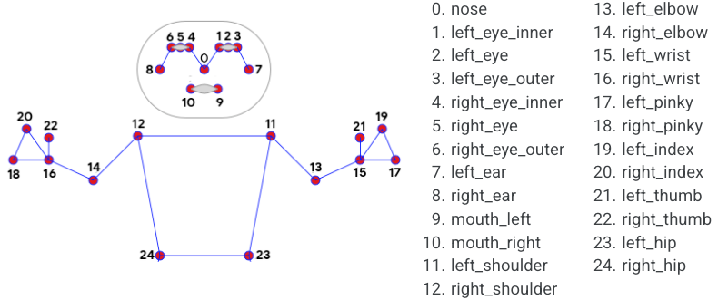

# MediaPipe Pose
{: .no_toc }

1. TOC
{:toc}
---

## Overview

Human pose estimation from video plays a critical role in various applications
such as quantifying physical exercises, sign language recognition, and full-body
gesture control. For example, it can form the basis for yoga, dance, and fitness
applications. It can also enable the overlay of digital content and information
on top of the physical world in augmented reality.

MediaPipe Pose is a ML solution for high-fidelity upper-body pose tracking,
inferring 25 2D upper-body landmarks from RGB video frames utilizing our
[BlazePose](https://ai.googleblog.com/2020/08/on-device-real-time-body-pose-tracking.html)
research. Current state-of-the-art approaches rely primarily on powerful desktop
environments for inference, whereas our method achieves real-time performance on
most modern [mobile phones](#mobile), [desktops/laptops](#desktop), in
[python](#python) and even on the [web](#web). A variant of MediaPipe Pose that
performs full-body pose tracking on mobile phones will be included in an
upcoming release of
[ML Kit](https://developers.google.com/ml-kit/early-access/pose-detection).

 |
:--------------------------------------------------------------------------------------------: |
*Fig 1. Example of MediaPipe Pose for upper-body pose tracking.*                               |

## ML Pipeline

The solution utilizes a two-step detector-tracker ML pipeline, proven to be
effective in our [MediaPipe Hands](./hands.md) and
[MediaPipe Face Mesh](./face_mesh.md) solutions. Using a detector, the pipeline
first locates the pose region-of-interest (ROI) within the frame. The tracker
subsequently predicts the pose landmarks within the ROI using the ROI-cropped
frame as input. Note that for video use cases the detector is invoked only as
needed, i.e., for the very first frame and when the tracker could no longer
identify body pose presence in the previous frame. For other frames the pipeline
simply derives the ROI from the previous frame’s pose landmarks.

The pipeline is implemented as a MediaPipe
[graph](https://github.com/google/mediapipe/tree/master/mediapipe/graphs/pose_tracking/upper_body_pose_tracking_gpu.pbtxt)
that uses a
[pose landmark subgraph](https://github.com/google/mediapipe/tree/master/mediapipe/modules/pose_landmark/pose_landmark_upper_body_gpu.pbtxt)
from the
[pose landmark module](https://github.com/google/mediapipe/tree/master/mediapipe/modules/pose_landmark)
and renders using a dedicated
[upper-body pose renderer subgraph](https://github.com/google/mediapipe/tree/master/mediapipe/graphs/pose_tracking/subgraphs/upper_body_pose_renderer_gpu.pbtxt).
The
[pose landmark subgraph](https://github.com/google/mediapipe/tree/master/mediapipe/modules/pose_landmark/pose_landmark_upper_body_gpu.pbtxt)
internally uses a
[pose detection subgraph](https://github.com/google/mediapipe/tree/master/mediapipe/modules/pose_detection/pose_detection_gpu.pbtxt)
from the
[pose detection module](https://github.com/google/mediapipe/tree/master/mediapipe/modules/pose_detection).

Note: To visualize a graph, copy the graph and paste it into
[MediaPipe Visualizer](https://viz.mediapipe.dev/). For more information on how
to visualize its associated subgraphs, please see
[visualizer documentation](../tools/visualizer.md).

## Models

### Pose Detection Model (BlazePose Detector)

The detector is inspired by our own lightweight
[BlazeFace](https://arxiv.org/abs/1907.05047) model, used in
[MediaPipe Face Detection](./face_detection.md), as a proxy for a person
detector. It explicitly predicts two additional virtual keypoints that firmly
describe the human body center, rotation and scale as a circle. Inspired by
[Leonardo’s Vitruvian man](https://en.wikipedia.org/wiki/Vitruvian_Man), we
predict the midpoint of a person's hips, the radius of a circle circumscribing
the whole person, and the incline angle of the line connecting the shoulder and
hip midpoints.

 |
:----------------------------------------------------------------------------------------------------: |
*Fig 2. Vitruvian man aligned via two virtual keypoints predicted by BlazePose detector in addition to the face bounding box.* |

### Pose Landmark Model (BlazePose Tracker)

The landmark model currently included in MediaPipe Pose predicts the location of
25 upper-body landmarks (see figure below), each with `(x, y, z, visibility)`.
Note that the `z` value should be discarded as the model is currently not fully
trained to predict depth, but this is something we have on the roadmap. The
model shares the same architecture as the full-body version that predicts 33
landmarks, described in more detail in the
[BlazePose Google AI Blog](https://ai.googleblog.com/2020/08/on-device-real-time-body-pose-tracking.html)
and in this [paper](https://arxiv.org/abs/2006.10204).

 |
:------------------------------------------------------------------------------------------------: |
*Fig 3. 25 upper-body pose landmarks.*                                                             |

## Example Apps

Please first see general instructions for
[Android](../getting_started/building_examples.md#android),
[iOS](../getting_started/building_examples.md#ios),
[desktop](../getting_started/building_examples.md#desktop) and
[Python](../getting_started/building_examples.md#python) on how to build
MediaPipe examples.

Note: To visualize a graph, copy the graph and paste it into
[MediaPipe Visualizer](https://viz.mediapipe.dev/). For more information on how
to visualize its associated subgraphs, please see
[visualizer documentation](../tools/visualizer.md).

### Mobile

*   Graph:
    [`mediapipe/graphs/pose_tracking/upper_body_pose_tracking_gpu.pbtxt`](https://github.com/google/mediapipe/tree/master/mediapipe/graphs/pose_tracking/upper_body_pose_tracking_gpu.pbtxt)
*   Android target:
    [(or download prebuilt ARM64 APK)](https://drive.google.com/file/d/1uKc6T7KSuA0Mlq2URi5YookHu0U3yoh_/view?usp=sharing)
    [`mediapipe/examples/android/src/java/com/google/mediapipe/apps/upperbodyposetrackinggpu:upperbodyposetrackinggpu`](https://github.com/google/mediapipe/tree/master/mediapipe/examples/android/src/java/com/google/mediapipe/apps/upperbodyposetrackinggpu/BUILD)
*   iOS target:
    [`mediapipe/examples/ios/upperbodyposetrackinggpu:UpperBodyPoseTrackingGpuApp`](http:/mediapipe/examples/ios/upperbodyposetrackinggpu/BUILD)

### Desktop

Please first see general instructions for
[desktop](../getting_started/building_examples.md#desktop) on how to build
MediaPipe examples.

*   Running on CPU
    *   Graph:
        [`mediapipe/graphs/pose_tracking/upper_body_pose_tracking_cpu.pbtxt`](https://github.com/google/mediapipe/tree/master/mediapipe/graphs/pose_tracking/upper_body_pose_tracking_cpu.pbtxt)
    *   Target:
        [`mediapipe/examples/desktop/upper_body_pose_tracking:upper_body_pose_tracking_cpu`](https://github.com/google/mediapipe/tree/master/mediapipe/examples/desktop/upper_body_pose_tracking/BUILD)
*   Running on GPU
    *   Graph:
        [`mediapipe/graphs/pose_tracking/upper_body_pose_tracking_gpu.pbtxt`](https://github.com/google/mediapipe/tree/master/mediapipe/graphs/pose_tracking/upper_body_pose_tracking_gpu.pbtxt)
    *   Target:
        [`mediapipe/examples/desktop/upper_body_pose_tracking:upper_body_pose_tracking_gpu`](https://github.com/google/mediapipe/tree/master/mediapipe/examples/desktop/upper_body_pose_tracking/BUILD)

### Python

MediaPipe Python package is available on
[PyPI](https://pypi.org/project/mediapipe/), and can be installed simply by `pip
install mediapipe` on Linux and macOS, as described below and in this
[colab](https://mediapipe.page.link/pose_py_colab). If you do need to build the
Python package from source, see
[additional instructions](../getting_started/building_examples.md#python).

Activate a Python virtual environment:

```bash
$ python3 -m venv mp_env && source mp_env/bin/activate
```

Install MediaPipe Python package:

```bash
(mp_env)$ pip install mediapipe
```

Run the following Python code:

<!-- Do not change the example code below directly. Change the corresponding example in mediapipe/python/solutions/pose.py and copy it over. -->

```python
import cv2
import mediapipe as mp
mp_drawing = mp.solutions.drawing_utils
mp_pose = mp.solutions.pose

# For static images:
pose = mp_pose.Pose(
    static_image_mode=True, min_detection_confidence=0.5)
for idx, file in enumerate(file_list):
  image = cv2.imread(file)
  # Convert the BGR image to RGB before processing.
  results = pose.process(cv2.cvtColor(image, cv2.COLOR_BGR2RGB))

  # Print and draw pose landmarks on the image.
  print(
      'nose landmark:',
       results.pose_landmarks.landmark[mp_pose.PoseLandmark.NOSE])
  annotated_image = image.copy()
  mp_drawing.draw_landmarks(
      annotated_image, results.pose_landmarks, mp_pose.POSE_CONNECTIONS)
  cv2.imwrite('/tmp/annotated_image' + str(idx) + '.png', annotated_image)
pose.close()

# For webcam input:
pose = mp_pose.Pose(
    min_detection_confidence=0.5, min_tracking_confidence=0.5)
cap = cv2.VideoCapture(0)
while cap.isOpened():
  success, image = cap.read()
  if not success:
    break

  # Flip the image horizontally for a later selfie-view display, and convert
  # the BGR image to RGB.
  image = cv2.cvtColor(cv2.flip(image, 1), cv2.COLOR_BGR2RGB)
  # To improve performance, optionally mark the image as not writeable to
  # pass by reference.
  image.flags.writeable = False
  results = pose.process(image)

  # Draw the pose annotation on the image.
  image.flags.writeable = True
  image = cv2.cvtColor(image, cv2.COLOR_RGB2BGR)
  mp_drawing.draw_landmarks(
      image, results.pose_landmarks, mp_pose.POSE_CONNECTIONS)
  cv2.imshow('MediaPipe Pose', image)
  if cv2.waitKey(5) & 0xFF == 27:
    break
pose.close()
cap.release()
```

Tip: Use command `deactivate` to exit the Python virtual environment.

### Web

Please refer to [these instructions](../index.md#mediapipe-on-the-web).

## Resources

*   Google AI Blog:
    [BlazePose - On-device Real-time Body Pose Tracking](https://ai.googleblog.com/2020/08/on-device-real-time-body-pose-tracking.html)
*   Paper:
    [BlazePose: On-device Real-time Body Pose Tracking](https://arxiv.org/abs/2006.10204)
    ([presentation](https://youtu.be/YPpUOTRn5tA))
*   [Models and model cards](./models.md#pose)
